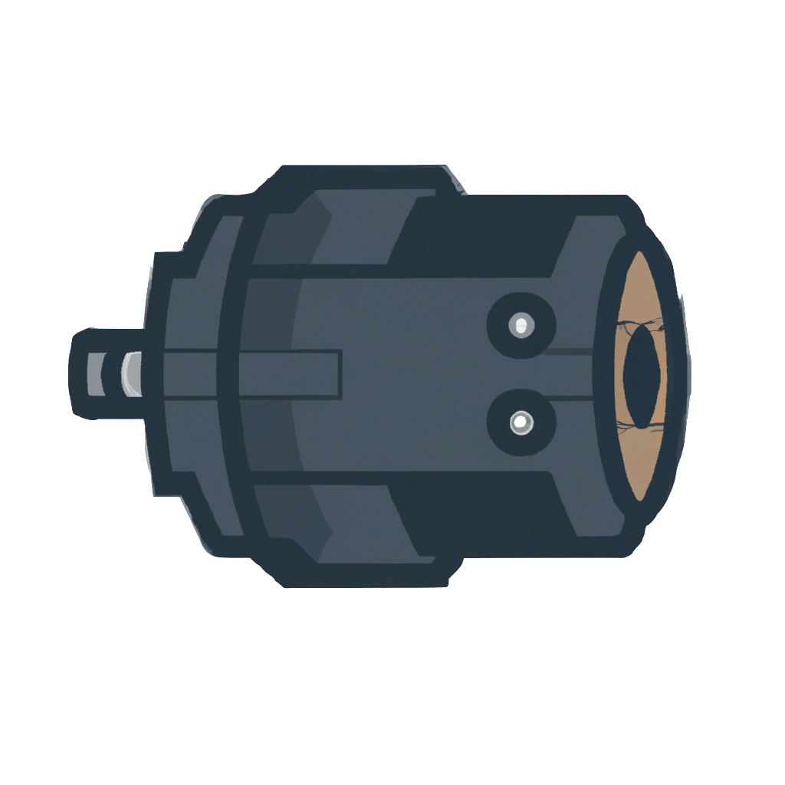

<div align="center">

</div>
<h1 align="center">Dynamo</h1>
<p align="center">
<span>
Dynamo 是一个融合了Dubbo和grpc的RPC框架，使用<b>字节码生成技术</b>实现了动态代理和属性注入，此外Dynamo还提供了gradle插件，支持IDL语言、增量编译等功能。
</span>
<br/>
</p>
<p align="center">
  
  <a href="https://www.npmjs.com/package/@web-printer/core"></a>
  <a href="./LICENSE"></a>
</p>

## 技术栈
springBoot + zooKeeper + netty

## 动态代理
对于一个RPC框架来说、本地调用远程实现时，需要在本地为接口生成一个实现；填充网络协议，建立请求，传参等逻辑，这个时候就需要动态代理，动态地去生成这个代理方法。

对于动态代理的实现，有以下几种方式 

JDK Proxy（基于反射）

Cglib(基于asm)

Java assist(基于Java文件)

ASM(基于字节码)

经典的RPC框架Dubbo的动态代理是基于Java assist,相较于JDK 提供的Proxy来说快了很多，但是还不够快。
为了追求极致，这里我们使用asm直接操作字节码生成代理类。

### 属性注入
同时为了易用性，这里利用ASM 还实现了类似于autowired的注解（RPCService）
client端使用RPCService注解后 框架可以自动注入代理类、并完成赋值。

### 整体工作流程

在框架初始化时、去扫描带有注解RPCService的类,下面是一个示例
```
public class Client{
    @RPCService
    private HelloService helloService;
    
    public void myMethod(){
        helloService.sayHello();
    }
}
```
扫描之后我们得到了RPC接口HelloService,以及宿主类Client
之后我们就需要使用asm生成一个实现了代理的HelloServiceImpl,实现sayHello方法 定义发起远程调用的一些逻辑

```
public String sayHello(String name) {
       
        RequestMessagePacket packet = new RequestMessagePacket();
        packet.setMagicNumber(1);
        packet.setVersion(1);
        packet.setSerialNumber("1");
        packet.setMessageType(MessageType.REQUEST);
        packet.setInterfaceName(output.getInterfaceName());
        packet.setMethodName(output.getMethodName());
        packet.setMethodArgumentSignatures((String[])output.getMethodArgumentSignatures().toArray(new String[0]));
        packet.setMethodArguments(new Object[0]);
        Channel channel = (Channel)ClientChannelHolder.CHANNEL_ATOMIC_REFERENCE.get();
        channel.writeAndFlush(packet);
        return String.format("[%s#%s]调用成功， 发送了[%s]到Netty Server[%s]", output.getInterfaceName(), output.getMethodName(), JSON.toJSONString(packet), channel.remoteAddress());
}
```
ok 使用asm生成了代理类之后，下一步我们就需要完成属性注入，让我们使用@RPCService定义的接口对象实例化，怎么做呢？

很简单，修改Client类的的构造方法即可

```
public Clinet(){
    this.helloService = new HelloServiceImpl();
}
```
这样helloService在使用前就会被初始化，对开发者很友好。原理是这样的 但是真正实现时，会遇到一些问题，

我们程序的运行过程是：Java代码   => 编译后的class文件 => load class 进内存

由于我们是运行时修改的和生成的 class 内存中并没有这些类，这时候就需要我们自定义一个classLoader，实现注入类的加载、以及修改类的替换

```加载类
public Clinet(){
    String packageName = "customrpc.server.service.HelloServiceImpl"
    MyClassLoader myClassLoader = new MyClassLoader(classPath + packageName);
    Class<?> Log = myClassLoader.loadClass("ccustomrpc.server.service.HelloServiceImpl");
    this.helloService = (HelloService) (Log.newInstance());
}
```
```替换类
Class<?> objClass = myClassLoader.findClass("customrpc.client.Client");
//把这个新的CLASS设置到另一个线程中
methodExcuteThread.getExcuteClassLocal().set(objClass);
```


## 已完成
- [x] 编码、解码协议
- [x] 序列化、反序列化
- [x] 动态代理、创建调用对象
- [x] 方法匹配、调用
- [x] 服务注册与发现
- [x] 线程池
- [x] asm实现动态代理
- [x] 实现自定义注解 属性注入
## Todo

- [ ] 负载均衡 
- [ ] 超时处理
- [ ] Cache
- [ ] idl插件
- [ ] 跨平台客户端语言生成
## 测试

### 测试环境

MacBook Air m1 16GB + 512GB

### 测试方式

十次测试取均值

### 测试结果

#### 单客户端并发调用

| Thread number | max(ms) | total(ms) |
| --- | --- | --- |
| 10, 000 | 59  | 266 |
| 100,000 | 62  | 526 |
| 1,000,000 | 60.2 | 2286 |

#### 多客户端并发调用

| Client number | max(ms) | total(ms) |
|---------------| --- | --- |
| 1  00         | 60  | 90  |
| 1 000         | 108 | 438 |
| 2 500         | 176 | 674 |

## 参考项目
[@throwable](https://github.com/zjcscut) [Netty和SpringBoot实现一个轻量级RPC框架](https://github.com/zjcscut/netty-tutorials)
